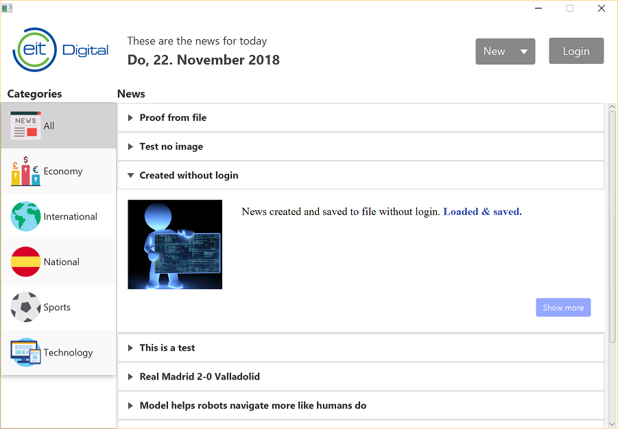

# Java Desktop application for the News Manager project

for 'Programming of User Interfaces'

## Requirements
* Java 8
* JavaFX
* Maven

## Setup
Note: this is not required for the submitted version

1. Create a copy of `config.properties.dist` inside the resources folder, called `config.properties`. Inside, add the anonymous authentication key for the server.
2. Make sure to add the folder `resources` as a source/resource folder in the IDE.
  * In Eclipse, open the project properties, go to "Java Build Path" and add it there as a source folder.
  * In IntelliJ, mark the folder as a resource folder
3. Enable Maven support. In Eclipse, right-click on the project, select "Configure" and click "Convert to Maven project"

## Implementation details
We have annotated our code with `@author students` so that also in given classes it is easy to find these changes

* Using a separate `resources` folder to store property files and images
* Using Maven to load dependencies, like JSON implementation and JFoenix Material Design
* There are two new packages `application.services` and `application.components`
* To separate config from the code, a separate `config.properties` was created which stores the API key
* Since we are using an accordion to show the list of news, the template for each accordion element is extracted into `NewsAccordionItem`
* Where applicable, we are using the JFoenix Material Design controls
* In `application.css` we are defining some default styles for elements

#### Services
* Added simple service registry with basic injection, using `ServiceRegistry`, `ServiceRegistryAware` in `application.services`
* The `SceneManager` in `application.services` manages the display of all scenes because we show most of them in the same window. It helps to abstract the process of showing scenes, but also saves the state of previous scenes, so we can easily go back. It checks if controllers are `ServiceRegistryAware` and injects the `ServiceRegistry`. Also, it supports `ControllerEvents` and fires `onBeforeShow` for these controllers.
* Controllers must implement the `NewsController` interface so that it works with the `SceneManager`

#### Shared header between main views
* Since we have the same header on the three main screens, the header is extracted into a separate component `NewsHead` in `application.components`. But since SceneBuilder doesn't play so well with it, they are only added from code, and not set in the FXML files
* For the same reason, a shared controller (`NewsCommonController`) and common model is added (`NewsCommonModel`)

#### Changes to given code
* In the `Categories` enum, we added a property to hold the image path for the image of each category
* To support a logout logic, the anonymous API key is saved as a member inside `ConnectionManager`
* We found that the publication date of articles from the server was missing, so we added support for it in `JsonArticle`
* In the `ImagePickerController` we changed the logic so that the image preview is directly shown when a new image is selected
* To support the `SceneManager` the code inside `Main` was adjusted as well
* Added a method in the `LoginModel` to facilitate the login process, returning a constructed `User` object

